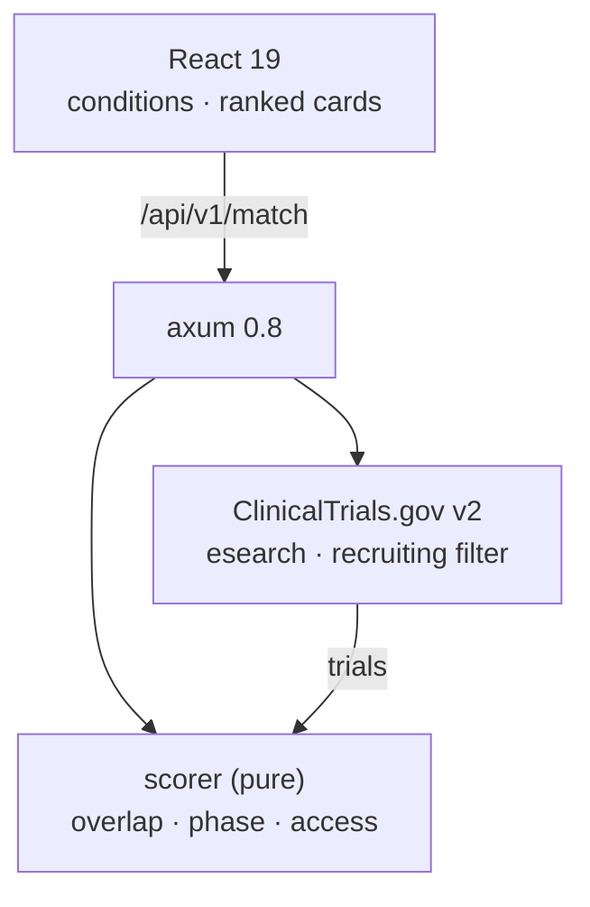

<p align="center">
  <h1>🔬 Clinical Trial Matcher</h1>
  <p><b>Match patient conditions to recruiting trials — ranked, scored, explained</b></p>
  <p>
    <a href="https://github.com/akarales/clinical-trial-matcher/actions/workflows/ci.yml"></a>
    
    
    
    
  </p>
</p>

Search recruiting trials on ClinicalTrials.gov (API v2) for a patient's
conditions, rank them with a **transparent scoring model**, and explain
every match. No API key; Rust (axum) client with pure, unit-tested
scoring; React client with condition presets.

**Jump to:** [Features](#-features) · [Architecture](#-architecture) · [Quickstart](#-quickstart) · [Configuration](#️-configuration) · [API](#-api) · [Docs](#-documentation) · [Roadmap](#️-roadmap)

> [!WARNING]
> Trial matching from public data. Not medical advice; eligibility is
> determined by trial sites.

## ⚡ Features

- **ClinicalTrials.gov v2 client** — recruiting-filtered condition
  queries, cursor pagination fields wired (`nextPageToken`), merged
  multi-condition search with NCT-id dedup
- **Transparent scoring (0–100, documented)** — condition-term overlap
  (Jaccard, bare numbers kept so *Type 2* ≠ *Type 1* Diabetes), recruiting
  status, phase ladder, site access
- **Reasons on every match** — the response states exactly why each
  trial scored what it did
- **Pure ranker** — scoring is a unit-tested module, swappable when
  eligibility criteria land in Phase 1

## 📐 Architecture



## 🚀 Quickstart

```bash
cargo run               # :8008
cd frontend && pnpm install && pnpm dev   # → http://localhost:5173
```

Needs network access to clinicaltrials.gov; the scoring and request
contracts are tested without it.

## ⚙️ Configuration

| Variable | Default | Notes |
|----------|---------|-------|
| `APP_PORT` | `8008` | 8000–8007 taken on this machine |

## 📡 API

| Endpoint | Purpose |
|----------|---------|
| `GET /health` | liveness |
| `POST /api/v1/match` | `{conditions: [...]}` → ranked trials with scores + reasons |

Scoring model + payload: [docs/API.md](docs/API.md).

## 📚 Documentation

| Page | What's inside |
|------|---------------|
| [docs/ARCHITECTURE.md](docs/ARCHITECTURE.md) | The v2 client, the scoring model, the tokenizer detail |
| [docs/API.md](docs/API.md) | Match endpoint with full response |
| [docs/DEVELOPMENT.md](docs/DEVELOPMENT.md) | Setup, testing, changing the weights |

## 🗺️ Roadmap

<details>
<summary>Phased plan</summary>

- [x] Phase 0 — scaffold: client, scoring, UI, CI
- [ ] Phase 1 — eligibility criteria extraction (age, sex, exclusions)
- [ ] Phase 2 — LLM explanation of each match (Ollama, schema-constrained)
- [ ] Phase 3 — saved patient profiles + watchlists (new-trial alerts)

</details>

## 🤝 Contributing

PRs welcome — see [CONTRIBUTING.md](CONTRIBUTING.md). Gates: `cargo
clippy --all-targets -- -D warnings`, `cargo test -q`, `pnpm build`.

## 📄 License

MIT — see [LICENSE](LICENSE).
